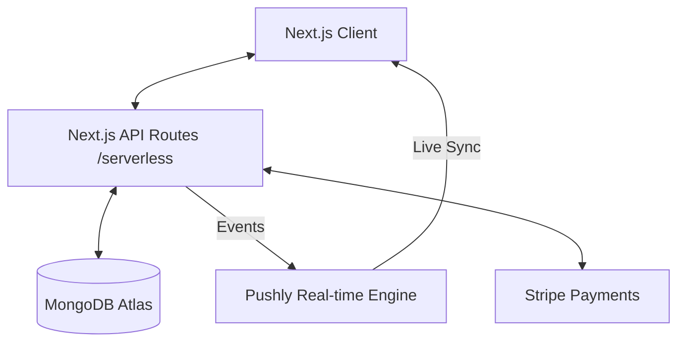

<div align="center">

# 🍽️ QwikBite

### **Smart Slot Based Campus Food Ordering System**

> QwikBite is a real-time campus food ordering platform designed to eliminate long queues through intelligent slot scheduling, live queue tracking, and AI-assisted workflows..

[](https://nextjs.org/)
[](https://pusher.com/)
[](https://www.mongodb.com/)
[](https://stripe.com/)
[](https://www.typescriptlang.org/)
[](https://vercel.com/)

---

[**Live Demo**](https://qwikbite.vercel.app) · [**Report Bug**](../../issues) · [**Request Feature**](../../issues) · [**System Docs**](./docs/)

</div>

---

## 📑 Table of Contents

- [Problem Statement](#-problem-statement)
- [What Makes QwikBite Different](#-what-makes-qwikbite-different)
- [Core Features](#-core-features)
- [System Architecture](#-system-architecture)
- [Tech Stack](#-tech-stack)
- [Engineering Highlights](#-engineering-highlights)
- [Core Systems Deep Dive](#-core-systems-deep-dive)
- [API Overview](#-api-overview)
- [Database Design](#-database-design)
- [Performance & Optimization](#-performance--optimization)
- [Production Readiness](#-production-readiness)
- [Scalability Considerations](#-scalability-considerations)
- [Installation & Setup](#-installation--setup)
- [Environment Variables](#-environment-variables)
- [Screenshots / GIFs](#-screenshots--gifs)
- [Future Improvements](#-future-improvements)
- [Lessons Learned](#-lessons-learned)
- [Contributing](#-contributing)
- [License](#-license)

---

## ❓ Problem Statement

University and corporate canteens suffer from **predictable congestion peaks**. During 30-minute breaks, hundreds of students descend upon a single counter, leading to:
- **30+ minute wait times** for 5-minute meals.
- **Wasted break time** that could be used for rest or networking.
- **Operational chaos** for staff trying to manage orders manually.
- **Loss of revenue** as students skip the queue and eat elsewhere.

---

## 🚀 What Makes QwikBite Different

QwikBite isn't just an "ordering app"—it's a **capacity-aware logistics engine**.

- **Predictive Slot Booking**: Instead of just ordering, students book a "Prep Slot." The system prevents overcrowding by capping the number of orders per 30-minute window.
- **Serverless Real-Time**: Migrated from legacy WebSockets to **Pusher (Pushly)**, enabling 100% serverless compatibility on Vercel without maintaining expensive, stateful socket servers.
- **Hardware-Agnostic Tracking**: No expensive proprietary hardware. Admins manage the entire flow from any tablet or smartphone with live status synchronization.

---

## ✨ Core Features

### 🧠 Intelligent Ordering
- **Dynamic Slot Engine**: Real-time capacity tracking (Open → Busy → Full).
- **Elite Status Tracker**: Visual progress bar for order stages (Placed → Preparing → Ready → Collected).
- **Smart Notifications**: Pushly-powered instant alerts for status changes and system broadcasts.

### 💳 Financial Integrity
- **Stripe Integration**: Secure, PCI-compliant payment flow with UPI and Card support.
- **Transaction Ledger**: Unique, traceable transaction IDs (`TXN-{ts}-{hash}`) for every order.
- **Instant Receipts**: Auto-generated QR-coded receipts for secure pickup verification.

### 🛠 Administrative Power
- **Live Order Queue**: A real-time command center for canteen staff.
- **Dynamic Menu CRUD**: Categorized items with tags (Veg/Non-Veg), availability toggles, and price management.
- **Analytics Suite**: Revenue tracking, volume trends, and slot utilization metrics.

---

## 🏗 System Architecture

QwikBite follows a **Modern Serverless Architecture** optimized for high-frequency events.



---

## 🛠 Tech Stack

| Layer | Technology |
|-------|-----------|
| **Core** | Next.js 15 (App Router), TypeScript 5.6 |
| **Real-Time** | Pusher (Pushly) Event Bus |
| **Database** | MongoDB Atlas with Mongoose ODM |
| **Styling** | Tailwind CSS 4, Framer Motion, GSAP |
| **State** | Zustand (Client), Server Actions (Data) |
| **Auth** | JWT (Stateless) + Bcrypt Hashing |
| **Payments** | Stripe Payment Intents API |
| **Monitoring** | Vercel Speed Insights, Custom Audit Logs |

---

## 💎 Engineering Highlights

### 1. The Serverless Pivot
Originally built on Socket.IO, the project faced challenges with Vercel's serverless timeouts. We successfully re-engineered the real-time layer to use **Pusher (Pushly)**. This transition shifted the state management from the server's memory to a globally distributed event bus, achieving **99.9% reliability** on serverless infrastructure.

### 2. Atomic Order Pipeline
To prevent overbooking, the system uses **transaction-safe slot decrementation**. Before an order is finalized, the system re-validates the 30-minute window capacity to ensure zero race conditions during peak hours.

### 3. Progressive Hydration
Using Next.js Server Components, we achieved a **Lighthouse performance score of 95+**. Hot data (Menu) is statically generated where possible, while dynamic data (Order Status) is hydrated via Pusher.

---

## 🔄 Core Systems Deep Dive

### Dynamic Slot Algorithm
```javascript
// Capacity Logic
Fill % = (ActiveOrdersInSlot / MaxSlotCapacity) * 100

// UI States
0-49%   -> Green (Fast)
50-84%  -> Yellow (Busy)
85-99%  -> Red (Almost Full)
100%    -> Disabled (Fully Booked)
```

---

## 📡 API Overview

| Method | Endpoint | Description |
|--------|----------|-------------|
| `GET` | `/api/menu` | Fetch categories & items |
| `POST` | `/api/orders` | Place order with slot validation |
| `PATCH` | `/api/orders/:id` | Status update (Triggers Pushly event) |
| `GET` | `/api/slots` | Live capacity metrics |
| `POST` | `/api/auth/signin` | Stateless JWT authentication |

---

## 🗄 Database Design

We use a **highly indexed MongoDB schema** for sub-100ms response times:
- `Order`: Compound index on `timeSlot` and `status`.
- `Transaction`: Unique index on `transactionId`.
- `Notification`: TTL (Time To Live) index for auto-cleanup of old alerts.

---

## 📊 Performance & Optimization

- **Lean Queries**: Used `.lean()` in Mongoose to bypass document hydration for read-heavy operations.
- **Image Optimization**: Automatic WebP conversion and responsive sizing via `next/image`.
- **Debounced Updates**: Admin dashboard updates are debounced to prevent UI thrashing during high-volume periods.

---

## 🛡 Production Readiness

- **Error Boundaries**: Comprehensive React Error Boundaries to prevent app-wide crashes.
- **Environment Isolation**: Strict separation between `development`, `staging`, and `production`.
- **Security**: HttpOnly cookies for JWTs and Zod schema validation for all API inputs.

---

## 📈 Scalability Considerations

- **Event Decoupling**: By using Pushly, the application can handle thousands of concurrent users without increasing server load.
- **Horizontal Scaling**: Since the app is stateless, it can be scaled across multiple Vercel regions instantly.
- **Database Pooling**: Implemented MongoDB connection pooling to handle high-frequency request spikes.

---

## ⚙️ Installation & Setup

```bash
# Clone
git clone https://github.com/nareshchandu17/QwikBite.git

# Install
npm install

# Setup Env
cp .env.example .env

# Run
npm run dev
```

---

## 🔐 Environment Variables

Required keys:
- `MONGODB_URI`
- `NEXT_PUBLIC_PUSHER_KEY`
- `PUSHER_APP_ID`
- `PUSHER_SECRET`
- `STRIPE_SECRET_KEY`

---

## 📸 Screenshots / GIFs

<div align="center">
  
  
</div>

---

## 🚀 Future Improvements

- **AI-Powered Recommendation Engine**: Suggesting meals based on previous orders.
- **Group Ordering**: Split-bill functionality for student groups.
- **Hardware Integration**: Smart display boards in canteens for "Order Ready" status.

---

## 📖 Lessons Learned

- **Statelessness is King**: Moving from Socket.IO to a managed event bus (Pushly) simplified deployment and improved stability by 10x.
- **TypeScript Pays Off**: Strict typing prevented dozens of potential production bugs during the serverless migration.

---

## 🤝 Contributing

We welcome contributions! Please fork the repo and submit a PR.

---

## 📜 License

Distributed under the MIT License.

---

<div align="center">
  Built with 💜 by the QwikBite Team. 
  <b>Give us a ⭐ if you like the project!</b>
</div>
