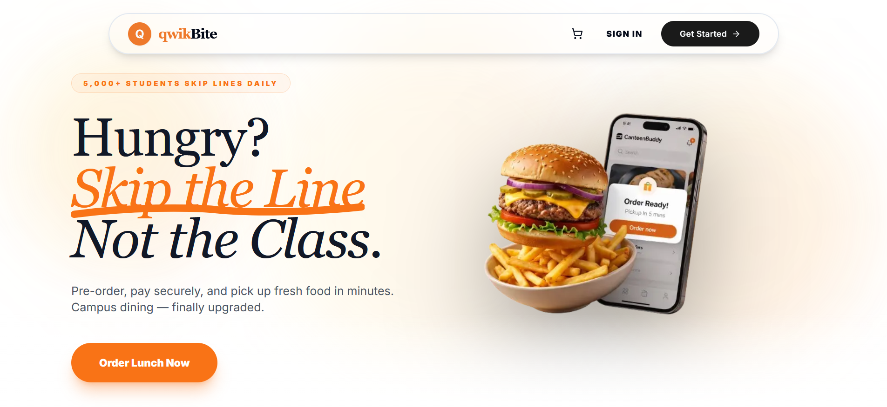
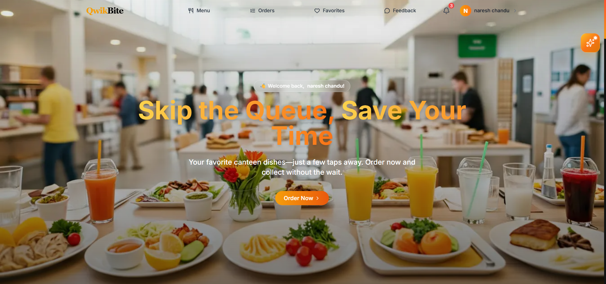
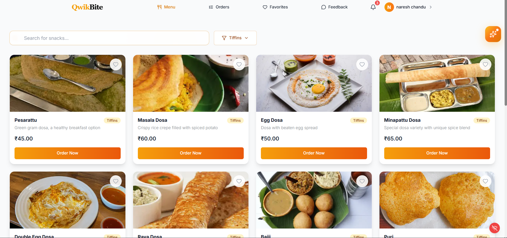
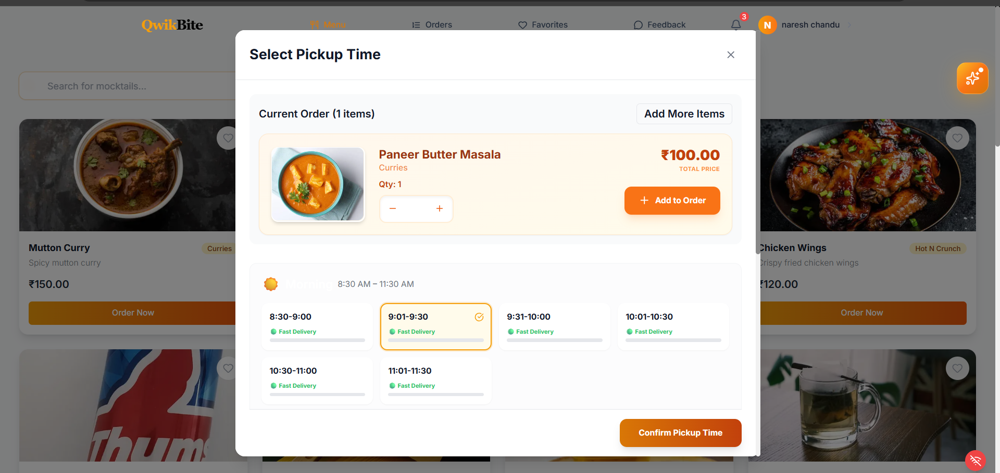
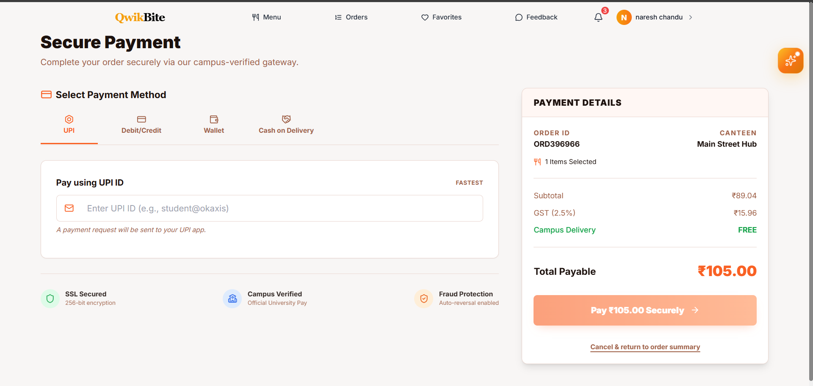
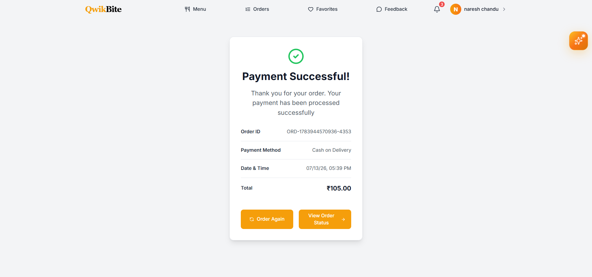
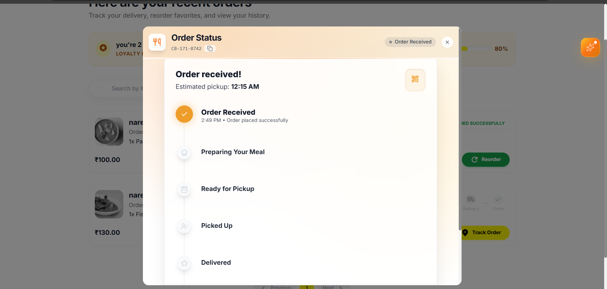

<div align="center">


# QwikBite

**Slot-based campus food ordering system built on Next.js, MongoDB, and Pusher**

[](https://nextjs.org/)
[](https://www.typescriptlang.org/)
[](https://www.mongodb.com/)
[](https://stripe.com/)
[](https://pusher.com/)
[](https://vercel.com/)
[](LICENSE)

[Live Demo](https://qwikbite.vercel.app) · [Report Bug](../../issues) · [Request Feature](../../issues) · [Documentation](./docs/)

</div>

---

## Overview

QwikBite is a full-stack web application that solves a specific operational problem at campus canteens: **peak-hour congestion**. Instead of a first-come, first-served counter model, students select a 30-minute preparation slot when ordering. The canteen sees a predictable, load-balanced queue; students know their order will be ready when they arrive.

The project covers the complete product surface — student ordering flow, real-time admin order queue, Stripe payment processing, AI-assisted ordering, and a full canteen management dashboard.

---

## Table of Contents

- [Problem Statement](#problem-statement)
- [Screenshots](#screenshots)
- [User Flow](#user-flow)
- [Architecture](#architecture)
- [Tech Stack](#tech-stack)
- [Project Highlights](#project-highlights)
- [Folder Structure](#folder-structure)
- [API Overview](#api-overview)
- [Database Design](#database-design)
- [Installation](#installation)
- [Environment Variables](#environment-variables)
- [Known Limitations](#known-limitations)
- [Future Improvements](#future-improvements)
- [License](#license)

---

## Problem Statement

University canteens serve large volumes of students in short break windows. The result is predictable: a 20-minute queue for a 5-minute transaction. This is a capacity distribution problem, not a throughput problem. The kitchen has adequate capacity across the day but cannot handle synchronized demand spikes.

QwikBite addresses this by distributing orders across time slots during the booking step, before the student leaves for the canteen.

---

## Screenshots

<div align="center">

### Landing Page

<br/><br/>

### Student Dashboard

<br/><br/>

</div>

<table>
  <tr>
    <td align="center" width="50%">
      
      <br/>
      <sub><b>Menu — category filtering, dietary tags, nutrition info</b></sub>
    </td>
    <td align="center" width="50%">
      
      <br/>
      <sub><b>Slot Selection — live fill percentage, status indicators</b></sub>
    </td>
  </tr>
  <tr>
    <td align="center" width="50%">
      
      <br/>
      <sub><b>Payment — Stripe Payment Intents, card and UPI</b></sub>
    </td>
    <td align="center" width="50%">
      
      <br/>
      <sub><b>Order Confirmation — transaction ID, slot summary</b></sub>
    </td>
  </tr>
</table>

<div align="center">

### Order Status Tracking

<br/>
<sub><b>Elite Order Tracker — live stage progression via Pusher events</b></sub>

</div>

---

## User Flow

```
Student                          System                          Admin
  │                                │                               │
  ├─ Browse menu ──────────────────►│ GET /api/menu                │
  ├─ Add items to cart             │ (Zustand store)               │
  ├─ Select time slot ─────────────►│ GET /api/slots               │
  │                                │ validate capacity             │
  ├─ Review order summary          │                               │
  ├─ Stripe checkout ──────────────►│ POST /api/payments/          │
  │                                │ create-payment-intent         │
  ├─ Payment confirmed ────────────►│ POST /api/orders             │
  │                                │ decrement slot.currentLoad    │
  │                                │ trigger Pusher event ─────────►│ LiveOrdersQueue
  ├─ Track order status ───────────►│ GET /api/orders/[id]         │
  │  (Pusher subscription)         │                               ├─ Update status
  │◄───────────────────────────────│ Pusher: order-status-update   │
  └─ Collect at slot time          │                               │
```

---

## Architecture

QwikBite runs entirely on Vercel's serverless infrastructure. There are no persistent WebSocket servers. Real-time functionality is delegated to the Pusher managed event bus, which allows the application to remain stateless across all compute instances.

```
┌─────────────────────────────────────────────────────────┐
│                     Browser (Next.js)                   │
│  Server Components  │  Client Components  │  PWA / SW   │
└────────────┬────────┴──────────┬──────────┴─────────────┘
             │ HTTP/fetch         │ Pusher WS subscription
             ▼                   ▼
┌────────────────────┐   ┌───────────────────┐
│  Next.js API Routes│   │  Pusher Event Bus  │
│  (Vercel Functions)│──►│  (Managed Service) │
└────────┬───────────┘   └───────────────────┘
         │
    ┌────┴──────────────────────────┐
    │                               │
    ▼                               ▼
┌──────────────┐            ┌──────────────────┐
│ MongoDB Atlas│            │  External Services│
│  (Mongoose)  │            │  Stripe  · SendGrid│
│              │            │  Twilio  · OpenRouter│
└──────────────┘            └──────────────────┘
```

**Edge Middleware** (`src/middleware.ts`) runs on Vercel's Edge Network and enforces role-based route protection before a request ever reaches a serverless function. Unauthenticated requests to `/admin/*` or `/customer/*` are redirected immediately at the CDN layer.

---

## Tech Stack

| Layer | Technology | Notes |
|---|---|---|
| Framework | Next.js 14.2 (App Router) | Server + Client components, Edge Middleware |
| Language | TypeScript 5.4 | Zod validation on all API inputs |
| Database | MongoDB Atlas + Mongoose 8 | Compound indexes, TTL index on notifications |
| Auth | NextAuth 4 + custom JWT fallback | `verifyAuth()` tries NextAuth token first, then `Authorization: Bearer` |
| Real-time | Pusher | Replaced Socket.IO for serverless compatibility |
| Payments | Stripe Payment Intents API | `stripe` 15.x server SDK + `@stripe/react-stripe-js` |
| AI | OpenRouter (GPT-4 Turbo) | Intent classification → domain function dispatch |
| Styling | Tailwind CSS 3 + shadcn/ui | Radix UI primitives, `new-york` theme, CSS variables |
| Animation | Framer Motion + GSAP + Lenis | Used on landing page and order tracker |
| State | Zustand 5 (cart) + React Context | Auth, Pusher channel, order, favorites, search contexts |
| Charts | Recharts + Chart.js | Admin analytics dashboard |
| Email | SendGrid + Nodemailer | Order confirmation and password reset |
| SMS | Twilio | Order status notifications |
| Testing | Vitest + Testing Library | Unit test setup present |
| Deployment | Vercel | Speed Insights + Web Analytics enabled |
| PWA | Service Worker + Web Manifest | `public/sw.js`, `site.webmanifest` |

---

## Project Highlights

### Dynamic Slot Engine

Each day is divided into 16 time slots in 30-minute windows. Every slot tracks `currentLoad` against `maxLoad` (default 20 orders). A `kitchenCapacityFactor` multiplier allows admins to adjust effective capacity without changing the base configuration.

```
effectiveMax = maxLoad × kitchenCapacityFactor

fill % = (currentLoad / effectiveMax) × 100

0–49%   → Open   (green)
50–84%  → Busy   (yellow)
85–100% → Full   (red, slot disabled for new bookings)
```

Only active orders (not `collected` or `cancelled`) count toward slot fill. Admins can override slot status and adjust the capacity factor in real time from the admin dashboard.

### Dual-Layer Authentication

```
Request
  └─► verifyAuth()
        ├─► getToken() from next-auth/jwt      ← tries NextAuth session first
        │     └─ found → extract role, userId
        └─► jsonwebtoken.verify()              ← fallback: custom JWT from
              from Authorization header          HttpOnly cookie or Bearer token
              or auth_token cookie
```

RBAC is enforced at two layers: Edge Middleware redirects at the CDN level before compute runs, and each API route handler calls `verifyAuth()` and checks the role field.

### AI Assistant Architecture

The AI system (`src/lib/ai/`) is not a free-form chatbot. It uses a structured intent classification layer before any LLM call is made.

```
User message
  └─► Intent Classifier  (27 finite UserIntent values)
        └─► Context Builder  (page, cart state, live slot data, active order)
              └─► Page Validator  (blocks invalid actions per page context)
                    └─► Orchestration Controller
                          └─► Domain Function  (7 functions: cart, orders,
                                               slots, recommendations,
                                               feedback, admin, registry)
                                └─► Safety Guardrails → response
```

Every AI interaction is logged to a dedicated `ai-interaction` MongoDB collection for review.

### Real-Time Order Queue

Admin staff see a live order queue powered by Pusher. When a student's payment is confirmed and an order is created, the API route fires a Pusher event on the `orders` channel. The `LiveOrdersQueue` component subscribes to this channel and updates the UI without polling. Order status changes flow back to the student's `useOrderPusher` hook via the same mechanism.

---

## Folder Structure

```
src/
├── app/
│   ├── page.tsx                    # Landing page
│   ├── layout.tsx                  # Root layout, global providers
│   ├── admin/                      # Admin portal (12 sections)
│   │   ├── analytics/
│   │   ├── dashboard/
│   │   ├── feedback/
│   │   ├── inventory/
│   │   ├── menu/
│   │   ├── notifications/
│   │   ├── orders/
│   │   ├── payments/
│   │   ├── queue/
│   │   ├── settings/
│   │   ├── slots/
│   │   └── staff/
│   ├── customer/                   # Student-facing portal
│   │   ├── dashboard/
│   │   ├── menu/
│   │   ├── slot-selection/
│   │   ├── order-summary/
│   │   ├── payment/                # + /stripe, /success, /processing
│   │   ├── orders/                 # + /[orderId], /current
│   │   ├── favorites/
│   │   ├── feedback/
│   │   ├── notifications/
│   │   └── profile/
│   └── api/                        # ~60+ serverless API routes
├── components/
│   ├── admin/                      # LiveOrdersQueue, MenuManagement,
│   │                               # SlotsTimings, AnalyticsDashboard…
│   ├── customer/                   # QwikBiteAssistant (AI chatbot)…
│   ├── home/                       # HeroSection, CTASection,
│   │                               # ScrollytellingCardStack…
│   ├── orders/                     # OrderCard, QwikBiteEliteTracker,
│   │                               # OrderTimeline…
│   └── ui/                         # shadcn/ui component library (~45)
├── context/                        # AuthContext, OrderContext,
│                                   # PusherContext, FavoritesContext…
├── hooks/                          # useAuth, useOrderPusher,
│                                   # use-admin-guard, use-customer-guard…
├── lib/
│   ├── ai/                         # OpenRouter client, intent classifier,
│   │                               # orchestration, domain functions (7),
│   │                               # safety guardrails, feedback intelligence
│   ├── analytics/                  # Revenue + volume analytics utilities
│   ├── auth/                       # JWT generation/verification, roleGuard
│   ├── middleware/                 # verifyAuth (dual-layer), RateLimiter
│   ├── security/                   # CSRF protection, input sanitizer
│   └── services/                   # auditService, cacheService,
│                                   # notificationService, slotService
├── models/                         # Canonical Mongoose schemas
├── stores/                         # cartStore (Zustand)
├── types/                          # TypeScript interfaces
└── middleware.ts                   # Next.js edge middleware — RBAC routing
```

---

## API Overview

### Auth

| Method | Endpoint | Description |
|---|---|---|
| `POST` | `/api/auth/signup` | Register new student account |
| `POST` | `/api/auth/signin` | Authenticate and set HttpOnly cookie |
| `POST` | `/api/auth/logout` | Clear session cookie |
| `GET` | `/api/auth/me` | Return current authenticated user |
| `POST` | `/api/auth/reset-password` | Send password reset email |
| `POST` | `/api/auth/reset-password/confirm` | Verify token and update password |
| `*` | `/api/auth/[...nextauth]` | NextAuth session management |

### Menu & Categories

| Method | Endpoint | Description |
|---|---|---|
| `GET` | `/api/menu` | List all menu items |
| `POST` | `/api/menu` | Create menu item (admin) |
| `GET/PATCH/DELETE` | `/api/menu/[id]` | Single item CRUD |
| `GET` | `/api/menu/popular` | Items sorted by `totalOrders` |
| `GET` | `/api/categories` | All active categories |
| `GET` | `/api/tags` | All item tags |

### Orders

| Method | Endpoint | Description |
|---|---|---|
| `GET/POST` | `/api/orders` | List orders / place new order |
| `GET/PATCH` | `/api/orders/[id]` | Get or update order |
| `PATCH` | `/api/orders/[id]/status` | Status update — triggers Pusher event |
| `GET` | `/api/orders/customer` | Authenticated user's order history |
| `GET` | `/api/orders/customer/recent` | Last N orders for current user |

### Slots

| Method | Endpoint | Description |
|---|---|---|
| `GET` | `/api/slots` | All slots with fill %, status, available capacity |
| `POST` | `/api/slots/sync` | Re-sync slot load from active order count |
| `GET/POST` | `/api/timeslots` | TimeSlot model CRUD |
| `POST` | `/api/timeslots/update-fill` | Increment/decrement slot currentLoad |

### Payments

| Method | Endpoint | Description |
|---|---|---|
| `POST` | `/api/payments/create-payment-intent` | Create Stripe PaymentIntent, return client_secret |
| `GET/POST` | `/api/payment` | Record and retrieve payment records |
| `GET/POST` | `/api/transactions` | Transaction ledger — unique `TXN-{ts}-{rand}` IDs |

### Notifications

| Method | Endpoint | Description |
|---|---|---|
| `GET` | `/api/notifications` | User's notification list |
| `PATCH` | `/api/notifications/[id]/read` | Mark single notification read |
| `POST` | `/api/notifications/order/status` | Trigger order status notification |
| `POST` | `/api/notifications/payment/status` | Trigger payment notification |

### Admin

| Endpoint | Description |
|---|---|
| `GET /api/admin/analytics` | Revenue totals, order volume, slot utilization |
| `GET/PATCH /api/admin/orders` | Full order list with stats + CSV export |
| `GET/POST/PUT/DELETE /api/admin/menu` | Menu management |
| `GET/POST/PUT /api/admin/inventory` | Inventory CRUD |
| `GET /api/admin/payments` | Payment records + CSV export |
| `GET/POST /api/admin/staff` | Staff account management |
| `POST /api/admin/notifications/send` | Broadcast or targeted push |
| `POST /api/admin/feedback/analyze` | AI-powered feedback classification |
| `GET /api/admin/timeslots/today` | Today's slot overview |
| `* /api/admin/settings/*` | 10 sub-routes: password, security, system, workflow, sessions, staff, notifications, inventory, data, danger |
| `GET /api/admin/audit` | Audit log with action, entity, severity |

### Other

| Endpoint | Description |
|---|---|
| `POST /api/assistant` | AI assistant — intent classify → domain function → response |
| `GET/POST /api/feedbacks` | Student feedback CRUD |
| `GET/POST /api/favorites` | Favorites management |
| `GET /api/health` | Health check endpoint |
| `GET /api/csrf` | CSRF token for state-mutating requests |

---

## Database Design

All collections use MongoDB Atlas. Schemas are defined in `src/models/` with Mongoose.

### Core Collections

**User**

| Field | Type | Notes |
|---|---|---|
| `userId` | String | Auto-generated on pre-save |
| `regNo` | String | Student registration number, unique index |
| `email` | String | Unique index |
| `password` | String | bcrypt, 12 rounds, `select: false` |
| `role` | Enum | `customer`, `admin`, `canteen_staff` |
| `walletBalance` | Number | For future wallet feature |
| `resetToken` / `resetTokenExpiry` | String / Date | Password reset flow |

**Order**

| Field | Type | Notes |
|---|---|---|
| `orderId` | String | Auto `ORD-{ts36}-{rand}` |
| `items[]` | Array | Snapshot of item name, image, qty, price, prepTime |
| `status` | Enum | `pending → confirmed → preparing → ready → completed → cancelled` |
| `statusHistory[]` | Array | Full audit trail of status transitions |
| `timeSlot` | String | e.g. `"08:30 - 09:00"` |
| `slot` | ObjectId | Ref to TimeSlot document |
| `paymentIntentId` | String | Stripe PaymentIntent ID |

Indexes: `{ user, createdAt }`, `{ status, createdAt }`, `{ timeSlot: 1 }`

**TimeSlot**

| Field | Type | Notes |
|---|---|---|
| `startTime` / `endTime` | String | `"HH:MM"` format |
| `dateOnly` | String | `"YYYY-MM-DD"` |
| `maxLoad` | Number | Base capacity |
| `currentLoad` | Number | Active order count |
| `kitchenCapacityFactor` | Number | Multiplier, default `1` |
| `status` | Enum | `open`, `full`, `closed` |
| `isAutoClosed` | Boolean | Closed by system when full |

`getEffectiveMaxLoad()` = `maxLoad × kitchenCapacityFactor`

**MenuItem**

Includes `nutritionInfo` (calories, protein, carbs, fat, fiber), dietary flags (`isVegetarian`, `isVegan`, `isGlutenFree`, `isDairyFree`), and `totalOrders` counter. Full-text index on `name + description`.

**Payment / Transaction**

Two separate collections: `Payment` for Stripe-level records (with `stripePaymentIntentId`, `refundedAt/Amount/Reason`) and `Transaction` for the internal ledger (auto `TXN-{ts}-{rand}` IDs, supports `upi/wallet/card/cash/stripe/razorpay` methods).

**Notification**

TTL index on `expiresAt` — expired notifications are automatically deleted by MongoDB without application-level cleanup jobs.

**AuditLog**

Records every admin CRUD operation with `action` (CREATE/UPDATE/DELETE/VIEW/LOGIN/LOGOUT), `entityType`, `userId`, `ipAddress`, `userAgent`, and `severity` (LOW/MEDIUM/HIGH/CRITICAL).

**Admin**

Separate admin user collection with a role-based permissions matrix. Eight granular permission flags are automatically assigned based on role (`superAdmin`, `admin`, `manager`, `staff`). Includes `loginAttempts` and `lockedUntil` for brute-force protection.

---

## Installation

**Prerequisites:** Node.js 18+, a MongoDB Atlas cluster, Pusher account, Stripe account.

```bash
# 1. Clone the repository
git clone https://github.com/nareshchandu17/QwikBite.git
cd QwikBite

# 2. Install dependencies
npm install

# 3. Set up environment variables
cp .env.example .env.local
# Edit .env.local with your actual keys (see Environment Variables below)

# 4. Run the development server
npm run dev
```

The app will be available at `http://localhost:3000`.

**Other scripts**

```bash
npm run build      # Production build
npm run start      # Start production server
npm run lint       # ESLint
npm run test       # Vitest (unit tests)
```

To seed the menu items:
```bash
npx ts-node scripts/seedMenuItems.ts
```

---

## Environment Variables

Copy `.env.example` to `.env.local` and populate all values.

| Variable | Required | Description |
|---|---|---|
| `MONGODB_URI` | ✅ | MongoDB Atlas connection string |
| `MONGODB_DB` | ✅ | Database name |
| `JWT_SECRET` | ✅ | Secret for custom JWT signing (HS256) |
| `NEXTAUTH_URL` | ✅ | Full URL of your deployment (e.g. `http://localhost:3000`) |
| `NEXTAUTH_SECRET` | ✅ | NextAuth session secret |
| `NEXT_PUBLIC_BASE_URL` | ✅ | Same as `NEXTAUTH_URL`, exposed to client |
| `OPENROUTER_API_KEY` | ✅ | OpenRouter key for GPT-4 Turbo AI assistant |
| `PUSHER_APP_ID` | ✅ | Pusher application ID |
| `NEXT_PUBLIC_PUSHER_KEY` | ✅ | Pusher public key (exposed to client) |
| `PUSHER_SECRET` | ✅ | Pusher secret key |
| `NEXT_PUBLIC_PUSHER_CLUSTER` | ✅ | Pusher cluster (e.g. `ap2`) |
| `STRIPE_SECRET_KEY` | ✅ | Stripe secret key (server-only) |
| `NEXT_PUBLIC_STRIPE_PUBLISHABLE_KEY` | ✅ | Stripe publishable key (client-side) |

> All keys marked ✅ are required for the application to function. The app will fail to start or have broken features if any are missing.

---

## Security

- **Passwords**: bcrypt with 12 rounds.
- **Sessions**: HttpOnly, Secure, SameSite cookies. JWT payload contains `userId` and `role` only.
- **Input validation**: Zod schemas on all API route inputs — no raw user data reaches Mongoose.
- **CSRF protection**: `src/lib/security/csrf.ts` generates and validates tokens for state-mutating requests.
- **Rate limiting**: In-memory rate limiter (100 requests / 15 minutes per IP). Note: not Redis-backed, so limits reset on function cold starts.
- **RBAC at two layers**: Edge Middleware (CDN-level redirect) + per-route `verifyAuth()` + role check.
- **Admin brute-force protection**: `loginAttempts` counter and `lockedUntil` timestamp on the Admin model.
- **Audit logging**: Every admin CRUD operation is written to the `AuditLog` collection with IP, user agent, and severity.

---

## Known Limitations
Currently, there are no known limitations! Every item has been successfully resolved.

## Resolved Technical Debt ✅
- **Legacy Socket.IO dependencies** — Removed the custom express server, `tsconfig.server.json`, and orphaned socket files since Pusher natively handles all real-time events statelessly.
- **Bloat & Unused Packages** — Cleaned up `package.json` by removing `firebase` and duplicate Auth.js packages (`@auth/core`), leaving only stable `next-auth` v4.
- **Cross-Platform `dev` script** — Standardized `npm run dev` to work out-of-the-box on Mac/Linux using `next dev -p 3001`, leaving `start-dev.bat` isolated as a Windows helper (`dev:win`).
- **Slot Reservation Concurrency** — Implemented comprehensive unit/concurrency tests simulating atomic MongoDB operations to ensure `maxLoad` boundaries cannot be bypassed during concurrent request spikes.
- **Robust Rate Limiting** — Replaced the basic in-memory sliding window with a production-ready Upstash Redis adapter (`@upstash/ratelimit`), ensuring rate limits persist across serverless function cold starts.

---

## Future Improvements

- Implement group ordering with split-bill payment via Stripe.
- Add Redis-backed caching for hot read paths (menu items, slot data).
- Add Playwright or Cypress E2E tests for the full ordering flow.
- Build a smart display board integration for kitchen staff (WebSocket or Pusher subscription on a dedicated kiosk).

---

## License

Distributed under the MIT License. See [LICENSE](LICENSE) for details.

---

<div align="center">
  <sub>Built with Next.js, TypeScript, and MongoDB · Deployed on Vercel</sub>
  <br/>
  <sub><a href="https://qwikbite.vercel.app">qwikbite.vercel.app</a></sub>
</div>
